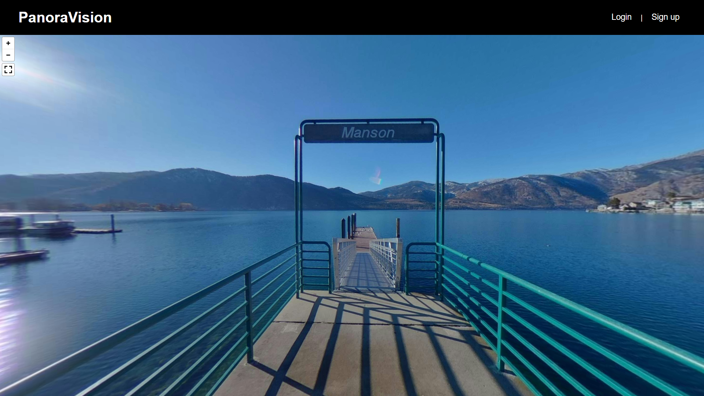
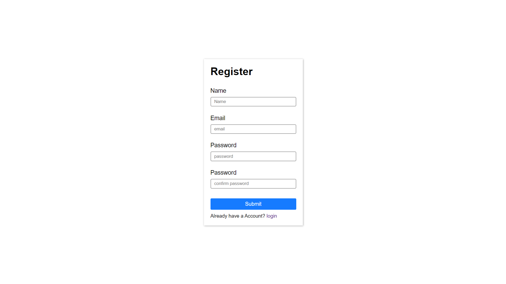
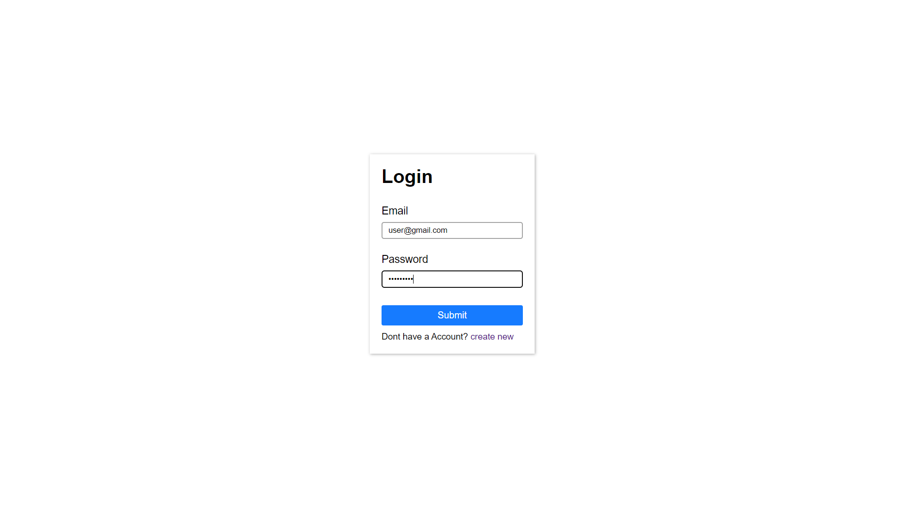
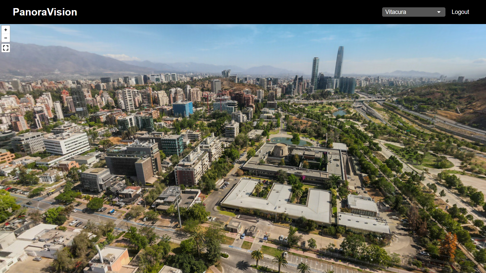
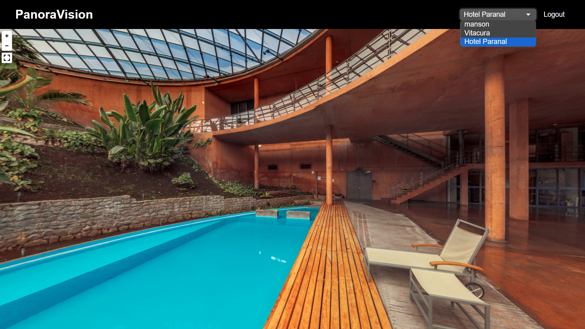
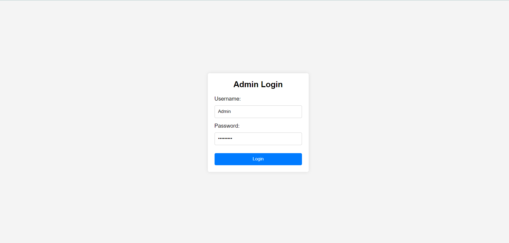
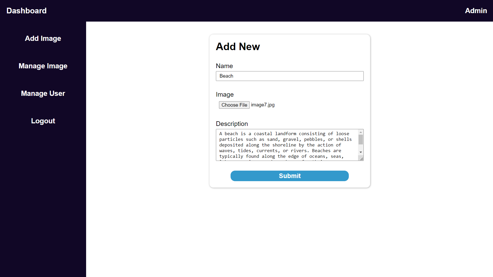
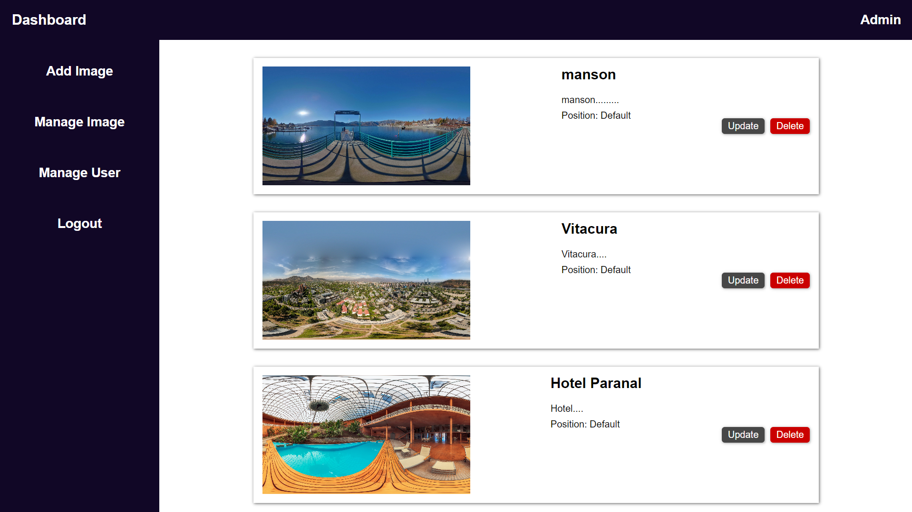
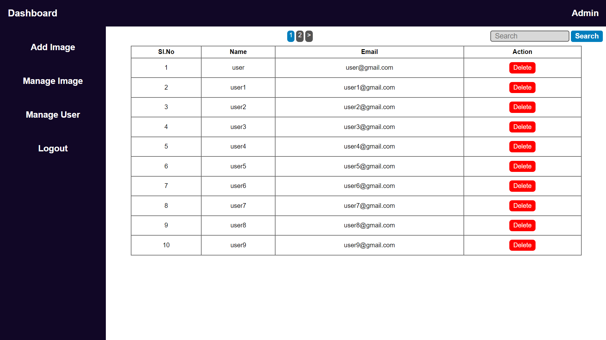

# PanoraVision360

PanoraVision360 enables users to explore panoramic images in stunning 360-degree views

---

### How to run PanoraVision360 Project

1. **Clone the repository or Download ZIP file:**

   - **Clone in cmd:** `cd root/directory` (e.g., `xampp/htdocs`)
     ```sh
     git clone https://github.com/developerasteroid/PanoraVision360.git
     ```
   - **Or Download ZIP file:** Download zip and Extract the file and copy PanoraVision360 folder. Paste inside root directory (e.g., `xampp/htdocs`).

2. **Open PHPMyAdmin**: [http://localhost/phpmyadmin](http://localhost/phpmyadmin)

3. **Create a database with name panoravision360**

4. **Import file:** `panoravision360.sql` given in project

5. **Launch project:** Open browser. In the address bar, type the URL [http://localhost/PanoraVision360](http://localhost/PanoraVision360)

---

### Index page



### User Register



### User Login



### User Home



### User Home 2



---

## Accessing the Admin Panel

To access the admin panel of the website, follow these steps:

1. **Open your web browser:** Launch your preferred web browser.

2. **Enter the Admin Panel URL:** In the address bar, type the URL for the admin panel. The admin panel URL [http://localhost/PanoraVision360/admin](http://localhost/PanoraVision360/admin)

3. **Log in:** Enter your administrator username and password when prompted.

4. **Navigate and Manage:** Once logged in, you will have access to the admin panel dashboard.

---

**Administrator login credentials:**

- Username: Admin
- Password: admin@123

---

### Admin Login



### Add new Image



### Manage Image



### Manage User


